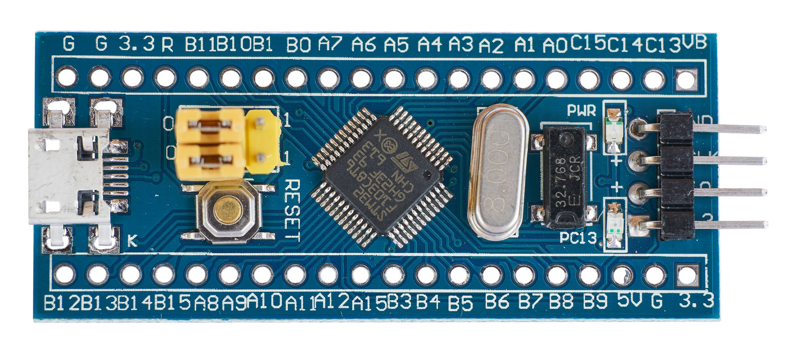
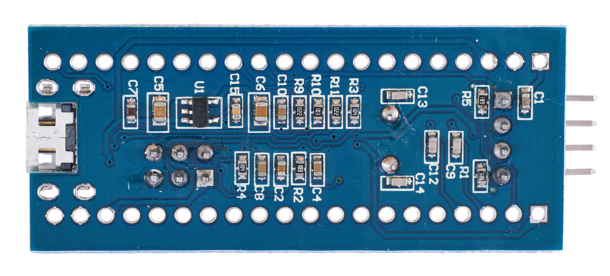

# BluePill STM32F103C8T6 Bootloader station
[website](http://believotron.com/believotronics) | [donate](https://www.patreon.com/Believotron) | [community](http://community.believotron.com/c/believotronics)

This is a WIP project to create a turnkey bootloader programming station for the "BluePill" STM32F103C8T6 development boards.

These boards are a great, low cost way to get started with Arduino or microcontrollers, but bootloading is still a dividing skill to access that low cost.

This project will contain hardware, 3D enclosure files, BOM, and instructions on how to program the bootloader.

# Walkthrough / Installation / Tutorial
[website](http://believotron.com/believotronics) | [donate](https://www.patreon.com/Believotron) | [community](http://community.believotron.com/c/believotronics)
## WIP

If you have a question, please [Check the issues](https://github.com/Believotron/BluePill_STM32F103C8T6_Bootloader_Station/issues) or [File a New Issue](https://github.com/Believotron/BluePill_STM32F103C8T6_Bootloader_Station/issues/new).

You may have to install pyserial to enable the USB to UART Serial device to work

`pip install pyserial`
